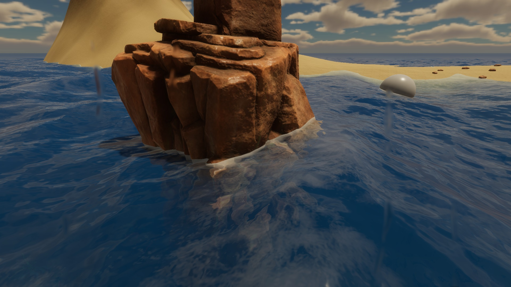

# GOcean
*for HDRP*

GOcean is an infinite ocean rendering system for Unity HDRP.

|  |  |  |
| --- | --- | --- |
|  |  | [video](youtube.com/watch?v=AB5YrOpPPXE)

### Installation

[Unity Manual](https://docs.unity3d.com/Manual/upm-ui-install2.html)

### Requirements

- Unity 6000.0
- HDRP 17.0.3
- Compute Shader support

### Workflow

1. Add the `Ocean.cs` component to any game object in the scene.
2. Modify the existing user parameters, or create a new one from *'Assets/Create/GOcean/Ocean Parameters'*, and assign it to the `parametersUser` field.
3. Add the `TerrainData.cs` component to any terrains that should interact with the ocean.

**Important notes when using terrain system**
- Terrains originate from origin, meaning one terrains pivot is at (0, 0, 0), and the horizontal offsets for other terrains are in steps of the terrain size
- No vertical offset of game object terrain component is attached to
- Terrains are all square (equal length and width)
- Terrains all have the same length, width, and height
- Terrains all have the same heightmap resolution

The Ocean can also be created from script. Only one Ocean instance can be in a scene at a time. Access this instance using `Ocean.Instance`.

You can query the ocean height and normal at an XZ position by adding an `OceanSampler` object to the static `Ocean.OceanSamplers` list, which gets updated
on fixed update.

There is a Simple Floater script, `SimpleFloater.cs`, that will stick any game object it is applied to, to the ocean surface.

There is a Floater script, `Floater.cs`, that will apply buoyant force to the rigibody of the game object it is attached to.

### Reference

| Properties				|																																|
| -------------------------	| -----------------------------------------------------------------------------------------------------------------------------	|
| Instance					| The Ocean singleton instance in the scene.																					|
| OceanSamplers				| Static list of OceanSampler objects; updated on FixedUpdate.																	|
| parametersUser			| The ParametersUser scriptable object whose parameters will be used to initialize the ocean.									|
| OceanM					| The ocean material.																											|
| DistantOceanM				| The distant ocean material.																									|
| FullscreenM				| The fullscreen effects material.																								|
| WaterScreenMaskM			| The underwater masking and water depth material.																				|
| WireframeM				| The wireframe material.																										|
| SpectrumCS				| The spectrum compute shader.																									|
| TerrainCS					| The terrain and shore wave compute shader.																					|
| UnderwaterCS				| The underwater effects compute shader.																						|
| MeshCS					| The mesh compute shader.																										|
| IsInitialized				| Is the ocean initialized.																										|
| CascadeShadowSplits		| Each component of the vector is the distance to the next split.																|
| CameraPositionStepped		| Stepped camera position based on mesh chunk size. XY is the stepped position, ZW is the camera position modded by chunk size.	|
| CameraZRotation			| Rotation around the cameras forward axis in radians.																			|
| WaterDampeningMultiplier	| Multiplier for rigid body linear dampening when submerged in water.															|
| WindDirection				| Direction the waves will generally be moving.																					|
| WindSpeed					| Controls the amplitude of the waves.																							|
| WaterHeight				| Height of the ocean plane, not to be confused with wave amplitude.															|
| Turbulence				| Overrides the wind direction.																									|

| Public Methods			|																																|
| -------------------------	| -----------------------------------------------------------------------------------------------------------------------------	|
| Initialize				| Initialize the ocean. Call after modifying parametersUser.																	|
| ReInitialize				| Will release resources (like render textures) before initializing.															|
| UpdateOnDemandDataBuffer	| Updates the OnDemandData constant buffer. Call this after modifying ocean properties.											|
| UpdateConstantDataBuffer	| Updates the ConstantData constant buffer.																						|
| SampleOcean				| Sample the ocean height and normal at a position.																				|

### Samples

There is an example scene located in *'Samples/Example Scene'*.
